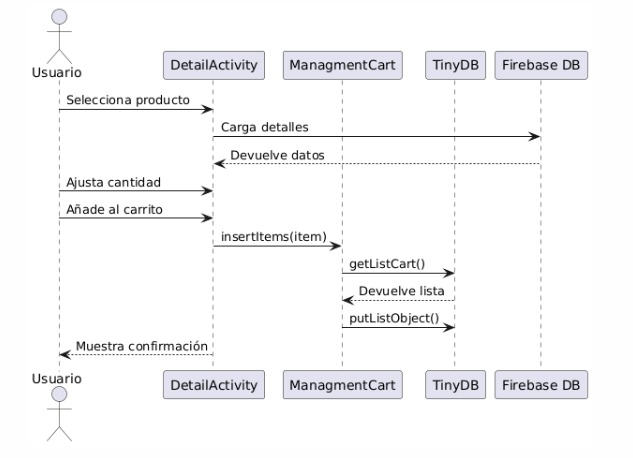
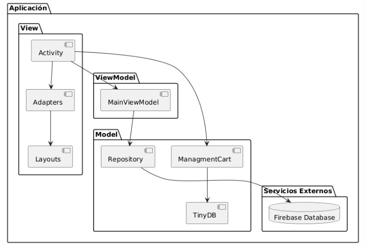

# Aplicación de E-Commerce para Android

## Descripción del Proyecto

Este proyecto es una aplicación Android de comercio electrónico (e-commerce) desarrollada en Kotlin. La aplicación permite a los usuarios explorar productos, filtrarlos por categorías, ver detalles, y añadirlos a un carrito de compras.

## Características Principales

- Pantalla de inicio con banner promocional
- Navegación por categorías de productos
- Visualización de productos populares
- Detalles de productos con múltiples imágenes
- Carrito de compras con gestión de cantidades
- Interfaz de usuario moderna y atractiva

## Tecnologías Utilizadas

- **Lenguaje**: Kotlin
- **Arquitectura**: MVVM (Model-View-ViewModel)
- **Base de Datos**: Firebase Realtime Database
- **Almacenamiento Local**: TinyDB (SharedPreferences)
- **Carga de Imágenes**: Glide
- **UI Components**: RecyclerView, ConstraintLayout

## Estructura del Proyecto

El proyecto sigue una estructura organizada por funcionalidades:

- **Activity**: Contiene todas las pantallas de la aplicación
- **Adapter**: Adaptadores para RecyclerView
- **Domain**: Modelos de datos
- **Helper**: Clases utilitarias
- **Repository**: Acceso a datos
- **ViewModel**: Lógica de presentación

## Diagramas

### Modelo Entidad-Relación

**Explicación:**
Este diagrama representa la estructura de datos de la aplicación y las relaciones entre las diferentes entidades:

- **Usuario**: Almacena la información de los usuarios registrados en la aplicación.
- **Carrito**: Cada usuario puede tener un carrito de compras asociado.
- **Item_Carrito**: Representa los productos añadidos al carrito, con su cantidad y tamaño seleccionado.
- **Producto**: Contiene toda la información de los productos disponibles (título, descripción, precio, valoración).
- **Categoría**: Clasifica los productos en diferentes grupos temáticos.
- **Imagen_Producto**: Almacena las múltiples imágenes asociadas a cada producto.

Las relaciones clave son:
- Un Usuario puede tener un Carrito (1:0..1)
- Un Carrito contiene varios Items de Carrito (1:0..n)
- Cada Item de Carrito corresponde a un Producto (0..n:1)
- Un Producto pertenece a una Categoría (0..n:1)
- Un Producto tiene varias imágenes asociadas (1:1..n)

### Diagrama de Secuencia

**Explicación:**
Este diagrama muestra la interacción entre los diferentes componentes del sistema cuando un usuario añade un producto al carrito de compras:

1. El Usuario selecciona un producto en la interfaz.
2. DetailActivity solicita los detalles del producto a Firebase Database.
3. Firebase devuelve la información completa del producto.
4. El Usuario ajusta la cantidad deseada del producto.
5. El Usuario presiona el botón "Añadir al carrito".
6. DetailActivity llama al método insertItems() de ManagmentCart.
7. ManagmentCart obtiene la lista actual del carrito desde TinyDB (almacenamiento local).
8. TinyDB devuelve la lista de productos en el carrito.
9. ManagmentCart actualiza la lista y la guarda nuevamente en TinyDB.
10. DetailActivity muestra una confirmación al Usuario.

Este flujo demuestra cómo la aplicación maneja la persistencia local de datos utilizando TinyDB para el carrito de compras, sin necesidad de comunicarse con el servidor para esta operación.

### Diagrama de Componentes

**Explicación:**
Este diagrama ilustra la arquitectura MVVM (Model-View-ViewModel) de la aplicación y cómo se organizan sus componentes:

- **View (Vista)**:
  - Activities: Pantallas principales de la aplicación (MainActivity, DetailActivity, CartActivity, etc.)
  - Adapters: Conectan los datos con los elementos visuales de RecyclerView
  - Layouts: Definen la estructura visual de la interfaz de usuario

- **ViewModel**:
  - MainViewModel: Gestiona los datos que se muestran en la interfaz y maneja la lógica de presentación
  - ManagmentCart: Administra las operaciones del carrito de compras

- **Model (Modelo)**:
  - Repository: Centraliza el acceso a datos, principalmente desde Firebase
  - TinyDB: Proporciona almacenamiento local para datos del carrito

- **Servicios Externos**:
  - Firebase Database: Almacena los datos de productos, categorías y banners

Las flechas indican las dependencias entre componentes, mostrando cómo fluyen los datos desde la base de datos hasta la interfaz de usuario, siguiendo los principios de la arquitectura MVVM para mantener una separación clara de responsabilidades.

## Instalación y Configuración

1. Clona el repositorio
2. Abre el proyecto en Android Studio
3. Sincroniza con Gradle
4. Configura tu proyecto en Firebase y descarga el archivo `google-services.json`
5. Coloca el archivo `google-services.json` en la carpeta `app/`
6. Ejecuta la aplicación en un emulador o dispositivo físico

## Requisitos

- Android Studio Arctic Fox o superior
- SDK mínimo: API 24 (Android 7.0)
- SDK objetivo: API 35
- Kotlin 1.8.0 o superior
- Conexión a Internet para acceder a Firebase

## Subir el proyecto a GitHub

Si deseas subir este proyecto a GitHub, hemos incluido un archivo con instrucciones detalladas:

[Instrucciones para subir el proyecto a GitHub](./GITHUB_INSTRUCCIONES.md)

Este archivo contiene todos los pasos necesarios, desde la inicialización del repositorio Git local hasta la publicación en GitHub.

