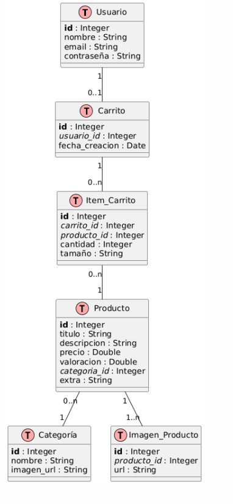

# Aplicación de E-Commerce para Android

## Descripción del Proyecto

Este proyecto es una aplicación Android de comercio electrónico (e-commerce) desarrollada en Kotlin. La aplicación permite a los usuarios explorar productos, filtrarlos por categorías, ver detalles, y añadirlos a un carrito de compras.

## Características Principales

- Pantalla de inicio con banner promocional
- Navegación por categorías de productos
- Visualización de productos populares
- Detalles de productos con múltiples imágenes
- Carrito de compras con gestión de cantidades
- Interfaz de usuario moderna y atractiva

## Tecnologías Utilizadas

- **Lenguaje**: Kotlin
- **Arquitectura**: MVVM (Model-View-ViewModel)
- **Base de Datos**: Firebase Realtime Database
- **Almacenamiento Local**: TinyDB (SharedPreferences)
- **Carga de Imágenes**: Glide
- **UI Components**: RecyclerView, ConstraintLayout

## Estructura del Proyecto

El proyecto sigue una estructura organizada por funcionalidades:

- **Activity**: Contiene todas las pantallas de la aplicación
- **Adapter**: Adaptadores para RecyclerView
- **Domain**: Modelos de datos
- **Helper**: Clases utilitarias
- **Repository**: Acceso a datos
- **ViewModel**: Lógica de presentación

## Diagramas

### Modelo Entidad-Relación

### Diagrama de Secuencia

### Diagrama de Componentes

## Instalación y Configuración

1. Clona el repositorio
2. Abre el proyecto en Android Studio
3. Sincroniza con Gradle
4. Configura tu proyecto en Firebase y descarga el archivo `google-services.json`
5. Coloca el archivo `google-services.json` en la carpeta `app/`
6. Ejecuta la aplicación en un emulador o dispositivo físico

## Requisitos

- Android Studio Arctic Fox o superior
- SDK mínimo: API 24 (Android 7.0)
- SDK objetivo: API 35
- Kotlin 1.8.0 o superior
- Conexión a Internet para acceder a Firebase

## Subir el proyecto a GitHub

Si deseas subir este proyecto a GitHub, hemos incluido un archivo con instrucciones detalladas:

[Instrucciones para subir el proyecto a GitHub](./GITHUB_INSTRUCCIONES.md)

Este archivo contiene todos los pasos necesarios, desde la inicialización del repositorio Git local hasta la publicación en GitHub.

